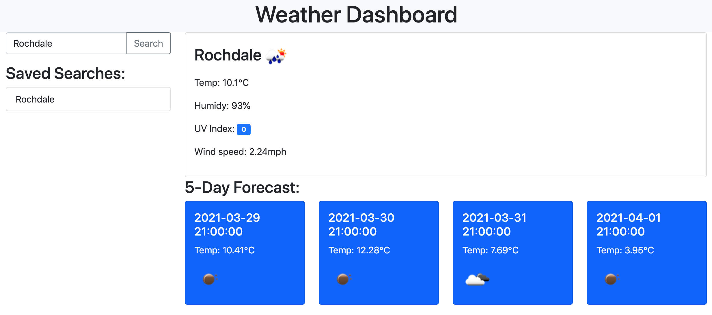

# weather-dashboard

> A weather forecast application.

## Link

https://osaxon.github.io/weather-dashboard/ 

## Features

Key features of the scheduler
* Users can search for a city or place and view current weather and a 5-day forecast
* Searches are saved locally for users to search again
* Weather conditions are retrieved from the Open Weather API

## Development

The application works by fetching data from the Open Weather API via JavaScript functions.

The data in the response is then rendered on screen using jQuery DOM methods.

Searches are saved using the browsers local storage.

## Final thoughts

I found this project quite challenging to complete and am not 100% satisfied with the end result - toward the end of the build, I realised the UV index information wasn't available in the data returned by the Open Weather API I chose to use, meaning I had to implement another API call to get the data needed. This affected the performance of the dashboard and could be improved in future by using the One Call API, which provides all current weather information and a forecast.

